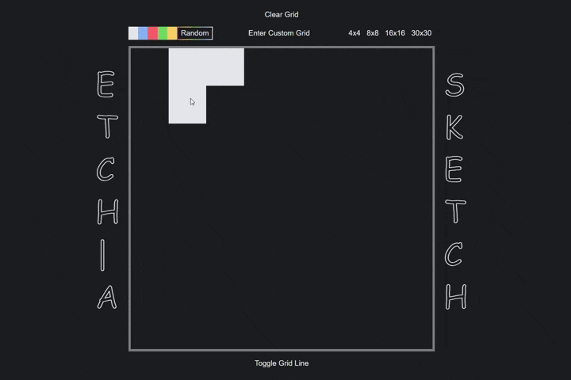

# ✏️ Etch-a-Sketch

### A browser-based drawing/sketchpad inspired by the classic Etch A Sketch toy.

This project is part of **The Odin Project Foundations** course,  
built to practice:

- **DOM manipulation**, **Event listeners**  
- **Dynamic** **grid** creation  
- Modern **responsive** design — using pure HTML, CSS, and JavaScript

---
> 📌 **Project status:** Completed ✅ | 🌐 [Live Preview](https://devansh-pipraiya.github.io/Etch-a-Sketch/)
---

## ✨ Features

- 🎨 **Multiple drawing mode** — 5 preset shades + Random mode  

- 🖱️ **Hover-based drawing** — instant real-time update  

- 📐 **Dynamic grid creation** — generate and resize grids on demand (presets + custom input) 

- 🧹 **Clear Grid** —  reset / clears drawing  

- 📏 **Toggle Grid Lines** — show/hide grid-lines

- 🌐 **Fully responsive design** — entire interface stays consistent and perfectly proportioned.

## Preview 👀

#### Demo

#### 4K responsive view

---

## 📚 What I Learned

- 🛠️ Advanced **DOM manipulation** – creating, removing, and dynamically updating many elements  

- 📱 Building **responsive layouts** using modern CSS tools (`min()`, `clamp()`, `aspect-ratio`, viewport units `vh vw vmin`)  

- ⚙️ Clean **state management** in JavaScript (colors, modes, grid size)  

- 🎯 Organizing **event handling** with delegation and callback functions  

- 🌐 Creating a **fully responsive UI** that stays consistent to any screen size, resolution, or scaling
    